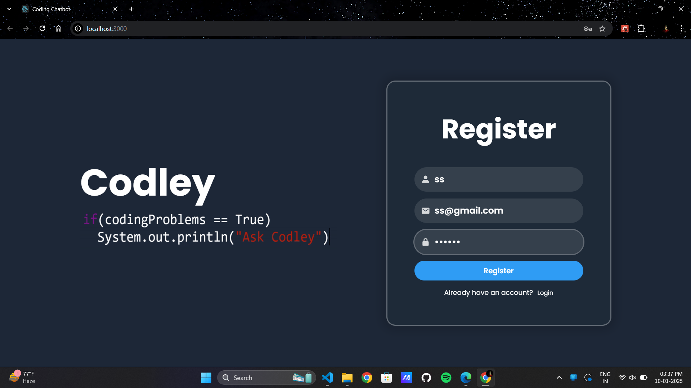
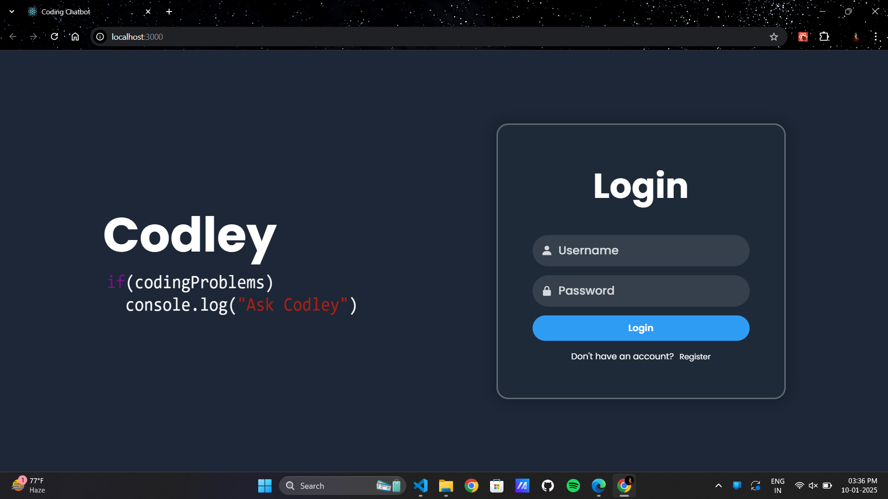
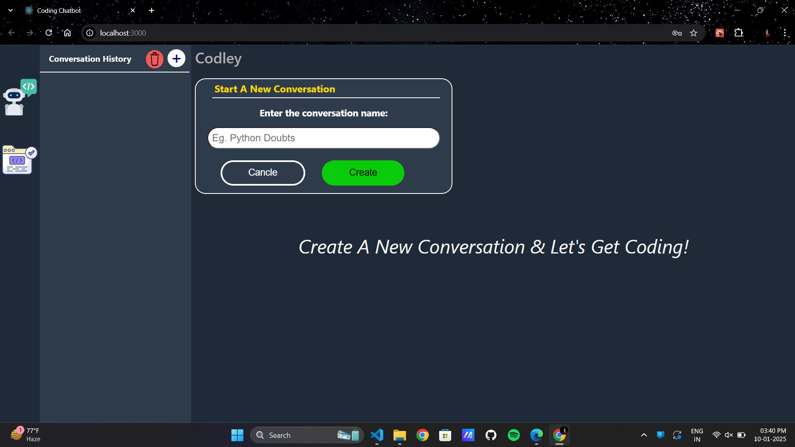
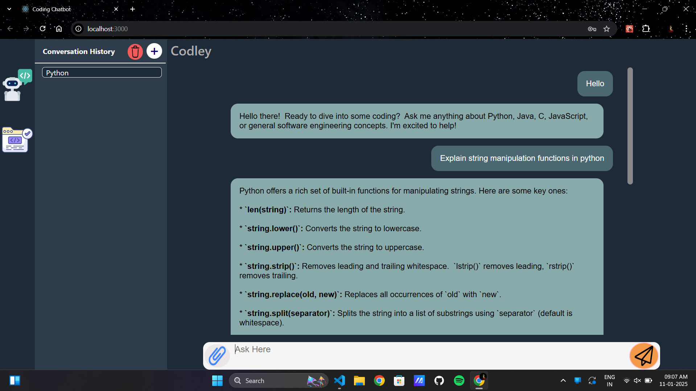
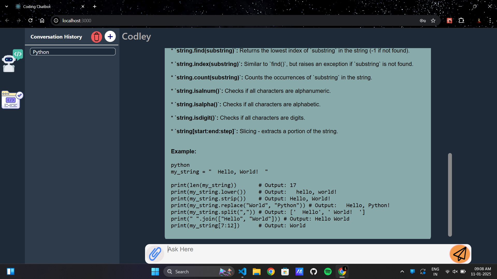
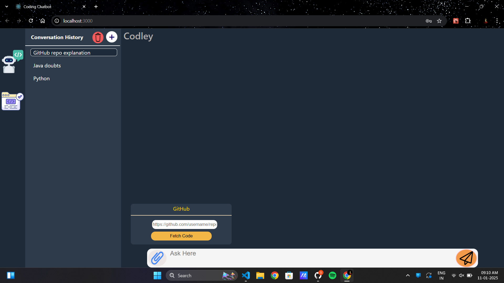
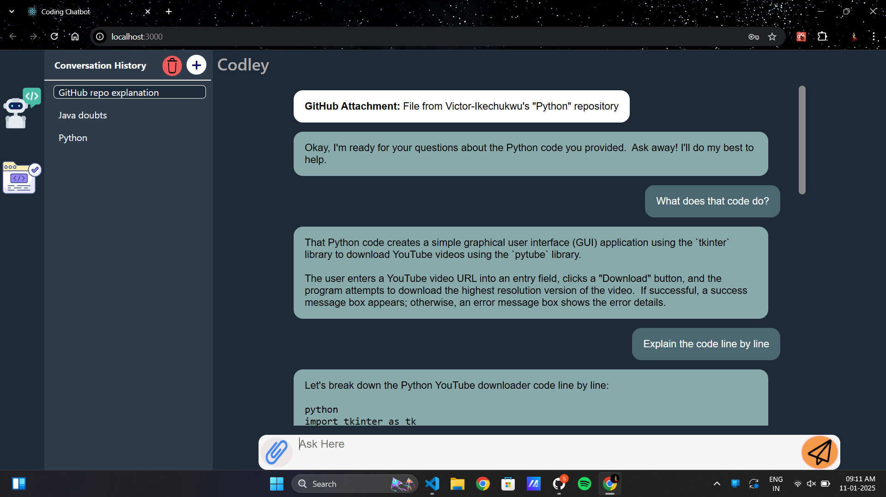
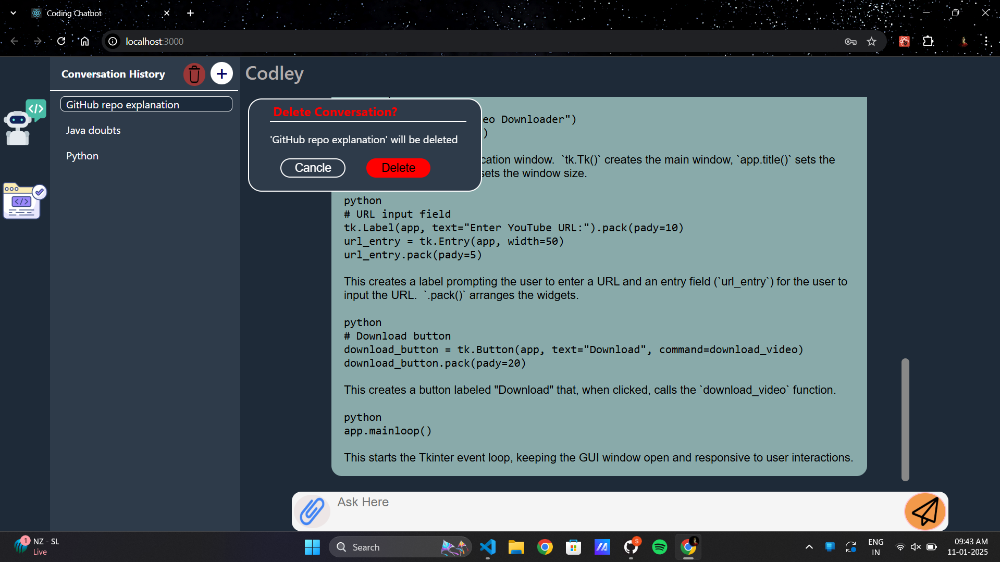
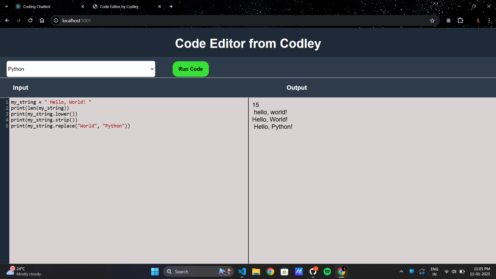

# Coding Chatbot  

A powerful and user-friendly chatbot designed to simplify the coding experience. Built using MERN stack & powered by the Gemini 1.5 flash model, this chatbot assists developers with debugging, code completion, and understanding complex coding concepts. Whether you're a beginner or an experienced programmer, this tool is here to make coding more accessible and efficient.  

## Chatbot UI

**User Registration & Login**

**Creating a new conversation**

**Text Input**

**GitHub Query**  

**Deleting a conversation**

**Code Editor**

## Features  
- **Input Support**  
  - Accepts text-based queries and GitHub repository links (permalink).  

- **Debugging**  
  - Identifies and resolves code errors, including multi-module projects and complex dependencies.  

- **Code Completion**  
  - Suggests code snippets to complete partially written programs.  

- **Code Explanation**  
  - Breaks down complex algorithms or concepts into simple, easy-to-understand explanations.  

- **Real-Time Processing**  
  - Leverages the Gemini 1.5 flash model for fast and accurate responses.  

- **Code Editor**  
  - Leverages PISTON API to compile the code

## Use Cases  
1. **Debugging**  
   - Fix circular dependencies in a GitHub repository.  
   - Identify syntax or logical errors in uploaded code.  

2. **Code Learning**  
   - Understand algorithms with clear explanations.  
   - Explore how different functions interact in a codebase.  

3. **Productivity Boost**  
   - Automate repetitive tasks like writing boilerplate code.  
   - Save time by completing incomplete scripts.  

## Technologies Used

- **Frontend**: React.js
- **Backend**: Express.js, Node.js
- **Database**: MongoDB
- **Model**: Gemini 1.5 flash model

---

## How It Works  
1. **Input**: Provide your coding problem through text or share a GitHub repository link (permalink).  
2. **Processing**: The chatbot analyzes the input, identifies issues or gaps, and prepares solutions.  
3. **Output**: Get actionable responses, including fixes, explanations, or suggestions.  
